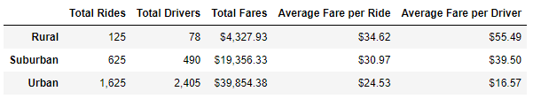
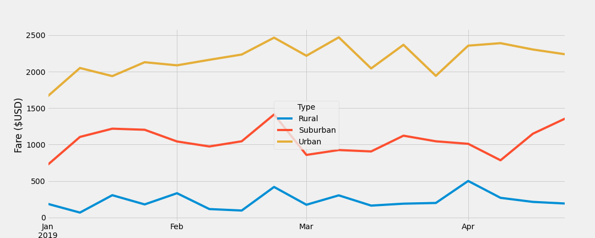

# PyBer_Analysis

## Project Overview

V.Isualize, the CEO of PyBer, has requested an analysis of company performance based on city type. This analysis will consist of:

- City type level summary
- Graph comparing city type fare summary for the first four months of 2019

The purpose of this analysis is to provide insights and recommendations into PyBer's ride sharing performance to allow for the company to make informed strategic decisions.

## Results

The below chart summarizes the results of the analysis across various key metrics

- Total Rides
  - For Total Rides for Urban (1,625) is 2.6x greater than Suburban (625) and 13x greater than Rural (125)

- Total Drivers
  - For Total Drivers for Urban (2405) is 4.9x greater than Suburban (490) and 30.8x greater than Rural (78)

- Total Fares
  - For Total Fares for Urban ($39,854.38) is 2.1x greater than Suburban ($19,356.33) and 9.2x greater than Rural ($4,327.93)

- Average Fare per Ride
  - For Average Fare per Ride for Rural ($34.62) is 1.1x greater than Suburban ($30.97) and 1.4x greater than Urban ($24.53)

- Average Fare per Driver
  - For Average Fare per Driver for Rural ($55.49) is 1.4x greater than Suburban ($39.50) and 3.3x greater than Urban ($16.57)

The below graph summarizes the comparative weekly fare performance for each city type during the first 4 months of 2019.

From this it can be observed that for all weeks shown Urban cities had the highest fare revenue while Rural cities had the lowest.  The lines are relatively flat for each city type, no more than $1000 difference between the highest and the lowest weeks for each line, indicating that demand is overall fairly consistent during the time period observed. The busest time was the thrid week of February when all three city times saw a spike in users.

## Summary

